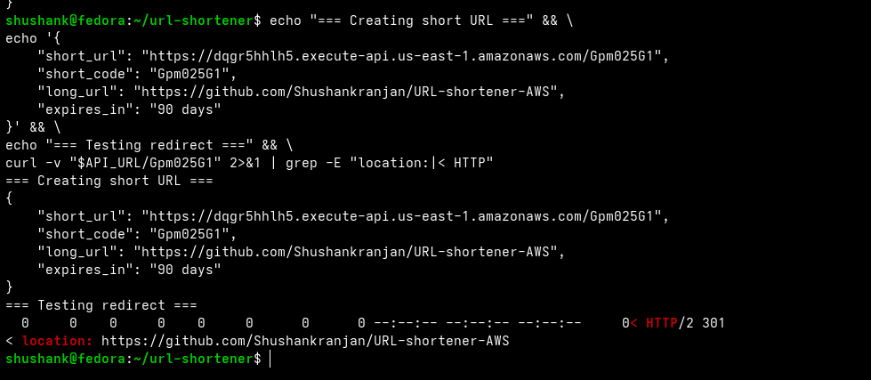
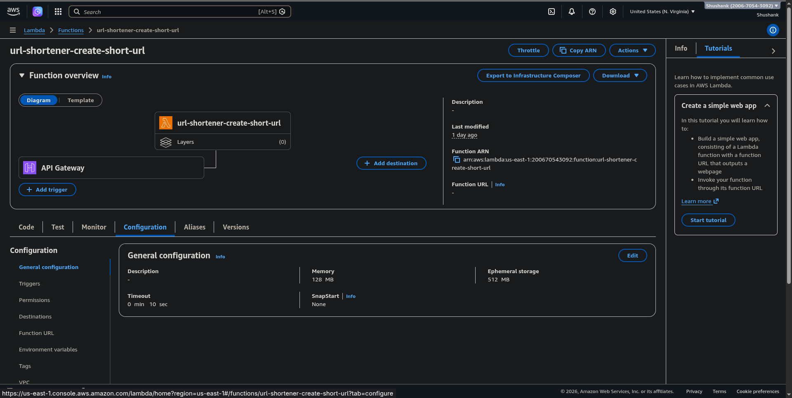
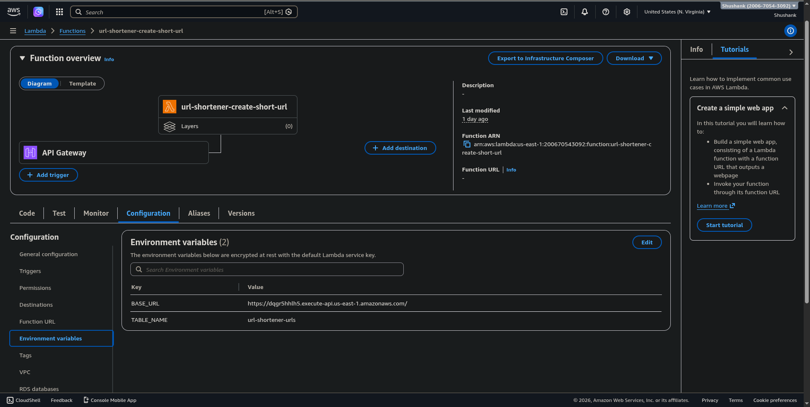
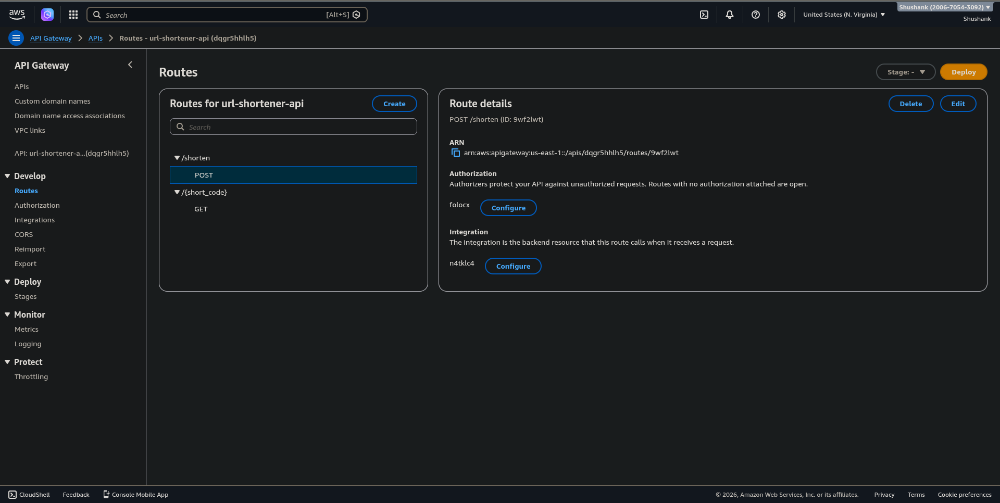
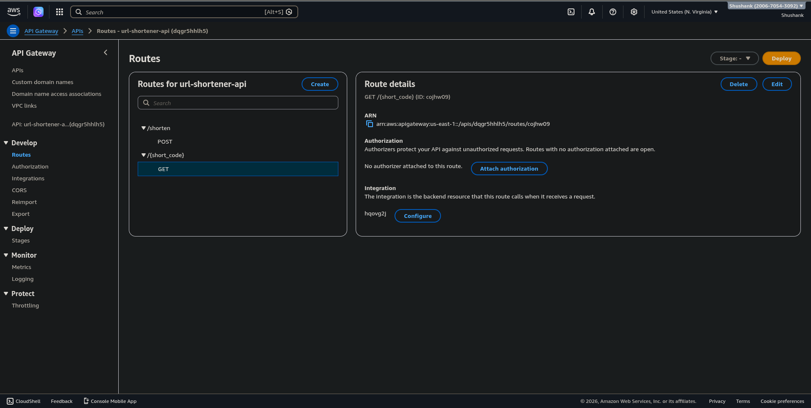
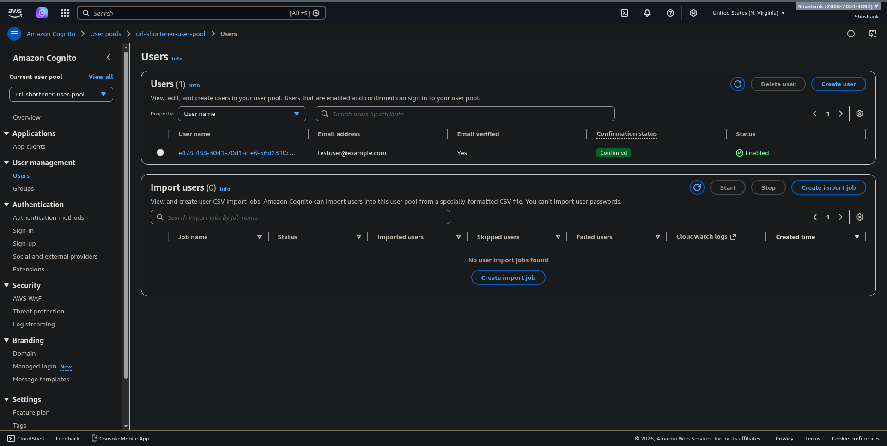
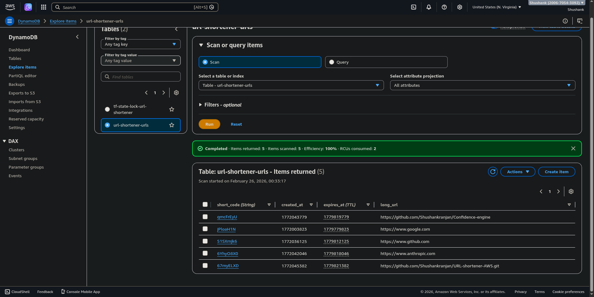

# ⚡ Serverless URL Shortener on AWS

A production-grade, fully serverless URL shortening service built on AWS — provisioned entirely with Terraform. Authenticated users can shorten any URL; anyone can follow the generated short link.

---

## Screenshots

### Terminal — Live Demo (Create + Redirect)
> Creating a short URL with JWT auth, then following the 301 redirect



---

### Lambda Function Configuration
> `url-shortener-create-short-url` — Python 3.12, 128MB, 10s timeout, API Gateway trigger wired



> Environment variables — `TABLE_NAME` and `BASE_URL` injected by Terraform at deploy time



---

### API Gateway Routes
> `POST /shorten` protected by Cognito JWT authorizer · `GET /{short_code}` intentionally public



> `GET /{short_code}` route — no authorizer attached, redirects are intentionally public by design



---

### Cognito User Pool
> `testuser@example.com` — email verified, status Confirmed, ready to authenticate



---

### DynamoDB — Live Data
> Real items stored in `url-shortener-urls` — `short_code`, `long_url`, `created_at`, `expires_at` all populated



---

## Architecture

```
Internet
    │
    ▼
┌─────────────────────────────────────────────────┐
│           API Gateway (HTTP API v2)             │
│                                                 │
│  POST /shorten ──[JWT required]──┐              │
│  GET  /{code}  ──[public]────────┼──────────┐  │
└──────────────────────────────────┼──────────┼──┘
                                   ▼          ▼
                          Lambda: create  Lambda: redirect
                          short_url()     url()
                                   │          │
                                   ▼          ▼
                          ┌─────────────────────┐
                          │       DynamoDB       │
                          │  short_code → URL    │
                          └─────────────────────┘
                                   ▲
                          ┌────────┴────────┐
                          │  Cognito        │
                          │  JWT Validator  │
                          └─────────────────┘
```

---

## Tech Stack

| Layer       | Service                          | Purpose                              |
|-------------|----------------------------------|--------------------------------------|
| API         | AWS API Gateway (HTTP API v2)    | Public HTTPS endpoint + JWT auth     |
| Compute     | AWS Lambda (Python 3.12)         | Short code generation + redirect     |
| Database    | AWS DynamoDB (on-demand)         | short_code → long_url mapping        |
| Auth        | AWS Cognito (User Pool + JWT)    | Protect the creation endpoint        |
| IaC         | Terraform 1.6+                   | All infrastructure as code           |
| State       | S3 + DynamoDB lock               | Remote state + concurrent-safe lock  |

---

## Features

- 🔐 JWT-protected creation endpoint via Cognito User Pool
- 🔀 Public redirect endpoint — no auth needed to follow links
- 🎲 Cryptographically random 8-character short codes (62⁸ = 218 trillion combinations)
- ⏰ Auto-expiry via DynamoDB TTL (90 days per link)
- 💾 Point-in-time recovery enabled on DynamoDB (35-day restore window)
- 🏷️ All resources tagged for cost tracking (`Project`, `ManagedBy`, `Environment`)
- 🔒 Least-privilege IAM — Lambda scoped to `GetItem` + `PutItem` on one table ARN
- ☁️ Remote Terraform state with S3 versioning + DynamoDB state locking
- 💰 ~$0.00/month at learning/low traffic (all within AWS free tier)

---

## Project Structure

```
url-shortener/
├── main.tf           # AWS provider config + S3 backend declaration
├── variables.tf      # All configurable values in one place
├── dynamodb.tf       # URL mapping table (PAY_PER_REQUEST + TTL + PITR)
├── lambda.tf         # IAM role, policy, and both Lambda functions
├── apigateway.tf     # HTTP API, routes, integrations, Lambda permissions
├── cognito.tf        # User Pool, App Client, JWT Authorizer, test user
├── outputs.tf        # API URL, table ARN, Cognito IDs
└── lambda/
    ├── create_short_url.py   # POST handler — generates code, writes to DynamoDB
    └── redirect_url.py       # GET handler — reads from DynamoDB, returns 301
```

---

## API Reference

### Create Short URL
```
POST /shorten
Authorization: Bearer <cognito_jwt_token>
Content-Type: application/json

{
  "long_url": "https://example.com/very/long/path"
}
```

**Response 201:**
```json
{
  "short_url": "https://<api-id>.execute-api.us-east-1.amazonaws.com/qmcFrEyU",
  "short_code": "qmcFrEyU",
  "long_url": "https://example.com/very/long/path",
  "expires_in": "90 days"
}
```

**Response 401** (missing/invalid token):
```json
{ "message": "Unauthorized" }
```

---

### Redirect
```
GET /{short_code}
(no auth required)
```

**Response 301** → `Location: https://example.com/very/long/path`

**Response 404:**
```json
{ "error": "Short code 'abc12345' not found" }
```

---

## Prerequisites

- AWS account with an IAM user that has `AdministratorAccess`
- [AWS CLI v2](https://aws.amazon.com/cli/) configured (`aws configure`)
- [Terraform 1.6+](https://developer.hashicorp.com/terraform/install)
- Python 3.x (for local JSON formatting only)

---

## Deployment

### Step 1 — Bootstrap (one-time manual setup)

Terraform can't manage its own backend, so create these manually first:

```bash
# Replace YOUR_ACCOUNT_ID with your AWS account ID
aws s3api create-bucket \
  --bucket tf-state-url-shortener-YOUR_ACCOUNT_ID \
  --region us-east-1

aws s3api put-bucket-versioning \
  --bucket tf-state-url-shortener-YOUR_ACCOUNT_ID \
  --versioning-configuration Status=Enabled

aws s3api put-public-access-block \
  --bucket tf-state-url-shortener-YOUR_ACCOUNT_ID \
  --public-access-block-configuration \
  "BlockPublicAcls=true,IgnorePublicAcls=true,BlockPublicPolicy=true,RestrictPublicBuckets=true"

aws dynamodb create-table \
  --table-name tf-state-lock-url-shortener \
  --attribute-definitions AttributeName=LockID,AttributeType=S \
  --key-schema AttributeName=LockID,KeyType=HASH \
  --billing-mode PAY_PER_REQUEST \
  --region us-east-1
```

### Step 2 — Update backend config

In `main.tf`, replace the bucket name with your actual bucket:
```hcl
backend "s3" {
  bucket = "tf-state-url-shortener-YOUR_ACCOUNT_ID"
  ...
}
```

### Step 3 — Deploy

```bash
terraform init
terraform plan
terraform apply
```

After apply, you'll see:
```
Outputs:
api_url                  = "https://<id>.execute-api.us-east-1.amazonaws.com"
cognito_client_id        = "<client_id>"
cognito_user_pool_id     = "<pool_id>"
dynamodb_table_name      = "url-shortener-urls"
```

---

## Usage

```bash
# Set permanent password for test user (one-time)
aws cognito-idp admin-set-user-password \
  --user-pool-id $(terraform output -raw cognito_user_pool_id) \
  --username testuser@example.com \
  --password "TempPass123!" \
  --permanent \
  --region us-east-1

# Get a JWT token (valid for 1 hour)
export TOKEN=$(aws cognito-idp initiate-auth \
  --auth-flow USER_PASSWORD_AUTH \
  --auth-parameters USERNAME=testuser@example.com,PASSWORD="TempPass123!" \
  --client-id $(terraform output -raw cognito_client_id) \
  --region us-east-1 \
  --query "AuthenticationResult.AccessToken" \
  --output text)

# Shorten a URL
export API_URL=$(terraform output -raw api_url)
curl -s -X POST "$API_URL/shorten" \
  -H "Content-Type: application/json" \
  -H "Authorization: Bearer $TOKEN" \
  -d '{"long_url": "https://github.com/Shushankranjan/URL-shortener-AWS"}' \
  | python3 -m json.tool

# Test the redirect
curl -v "$API_URL/<short_code>" 2>&1 | grep -E "location:|< HTTP"
```

---

## Teardown (Spend $0 after learning)

```bash
# Remove all Terraform-managed resources
terraform destroy

# Manually delete the S3 state bucket
aws s3 rb s3://tf-state-url-shortener-YOUR_ACCOUNT_ID --force

# Manually delete the DynamoDB lock table
aws dynamodb delete-table \
  --table-name tf-state-lock-url-shortener \
  --region us-east-1
```

---

## Cost Estimate

| Service              | Free Tier                          | This Project         |
|----------------------|------------------------------------|----------------------|
| Lambda               | 1M requests/month forever          | ~$0.00               |
| DynamoDB             | 25 GB + 25 RCU/WCU forever         | ~$0.00               |
| API Gateway HTTP API | 1M calls/month (12 months)         | ~$0.00               |
| Cognito              | 50,000 MAU forever                 | ~$0.00               |
| S3 state bucket      | 5 GB (12 months)                   | ~$0.00               |
| **Total**            |                                    | **~$0.00/month**     |

---

## Security Notes

- JWT validation happens at the API Gateway layer — unauthenticated requests never reach Lambda
- Lambda IAM role is scoped to `dynamodb:GetItem` and `dynamodb:PutItem` on one specific table ARN
- S3 state bucket has public access fully blocked and versioning enabled
- DynamoDB point-in-time recovery enabled (35-day restore window)
- Short codes use `secrets.choice` (cryptographically random) — not `random.choice`

---

## Author

**Shushank Ranjan** — [GitHub](https://github.com/Shushankranjan)
